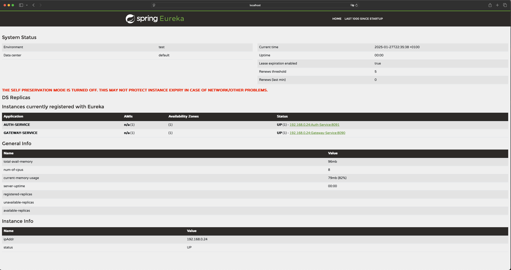

# Auth Service Documentation

## Introduction
Auth-Service is a microservice responsible for handling authentication and authorization in our application.
It has been written by using technologies:

* Java version 21.0.2
* Spring Boot version 3.3.4
* Spring Cloud version 2023.0.3
* Eureka client: Spring Cloud Netflix Eureka
* Spring Security: for authentication and authorization
* JWT (JSON Web Token): using io.jsonwebtoken to create and verify tokens
* MySQL: using mysql-connector-java version 8.0.33
* Spring Data JPA: for database and ORM access
* Spring Mail: for sending emails
* Spring doc OpenAPI version 2.3.0 for API documentation and Swagger UI integration
* Lombok to reduce boilerplate code in Java
* JUnit & Spring Security Test for testing with JUnit 5 and security testing tools
* Gradle: as a building tool and dependency manager

### Functionality:

1. User registration
   * allows users to register their accounts in the system, encrypts user password by HS256 algorithm and validate email
address by sent 6 digits code for given email address

2. Login and JWT token generation
    * verify user credentials and generate a JWT token
    * JWT token is used by clients and other services to validate user identity and access permissions

## Setup and configuration

* [.env.example](.env.example)
* [application.properties](src/main/resources/application.properties)
* [gradle config file](build.gradle)

## How it works?
To run project ensure that all dependencies are installed end you have correctly configured Eureka-Service, Gateway-Service.
Run first the Eureka-Service, then the Eureka-Gateway by entering command:

```shell
mvn spring-boot:run
```
And the next step run Auth-Service by entering command:

```shell
./gradlew bootRun
```

Once the Eureka-Service, Eureka-Gateway and Auth-Service is running, you can access the dashboard by navigating to the following URL in your
browser:

http://localhost:8761

The result should look like this:



### Entity class
This class implements the UserDetails interface. It represents the structure for storing essential user information in the database,
such as username, email, password and account status:

* [Entity class](src/main/java/SocialTalk/Auth_Service/Model/User.java)

### The AuthenticationController class 
The controller interacts with the AuthenticationService and JwtService to ensure secure user access:

* [AuthenticationController](src/main/java/SocialTalk/Auth_Service/Controller/AuthenticationController.java)

### API Endpoints

| **HTTP Method** | **Endpoint**                  | **Description**                                                          |
|-----------------|-------------------------------|--------------------------------------------------------------------------|
| **POST**        | `/auth/signup`                | Register a new user with the provided registration details               |
| **POST**        | `/auth/login`                 | Authenticate user credentials and return JWT token with expiration time  |
| **POST**        | `/auth/verify`                | Verify the user account using the verification code                      |
| **POST**        | `/auth/resend`                | Resend the verification code to the specified email address              |
| **POST**        | `/auth/resetPasswordRequest`  | Sends a password reset link to the provided email address                |
| **POST**        | `/auth/resetPassword`         | Resets user password using the reset token and the new password provided |

 
| **Parameter**       | **Endpoint**                 | **Type**   | **Description**                                                       |
|---------------------|------------------------------|------------|-----------------------------------------------------------------------|
| `registerUserDTO`   | `/auth/signup`               | Object     | User data for registration (username, email, password)                |
| `loginUserDTO`      | `/auth/login`                | Object     | The login credentials (email, password)                               |
| `verifyUserDTO`     | `/auth/verify`               | Object     | The verification details (verification code)                          |
| `email` 	           | `/auth/resend`               | String     | The email address to which the verification code will be resent       |
| `email`             | `/auth/resetPasswordRequest` | String     | The email address for sending the password reset link                 |
| `resetToken`        | `/auth/resetPassword`        | String     | The reset token from cookies for verifying the password reset request |
| `newPassword`       | `/auth/resetPassword`        | String     | The new password that the user wishes to set                          |

## Important annotations

For the Auth-Service to work properly, make sure that the following annotations have been added to the main
application class:

* **@SpringBootApplication:** this is mandatory for Spring Boot,
* **@EnableEurekaClient:** is used to enable Eureka Client functionality in a Spring Boot application